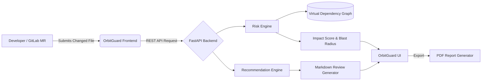

<div align="center">
  <h1>🛡️ OrbitGuard AI</h1>
  <p><b>AI-Powered Merge Request Risk Analyzer</b></p>

  <p>
    <a href="https://orbit-guard-ai.vercel.app/"></a>
    <a href="https://orbitguard-ai-tgj9.onrender.com/docs"></a>
    <a href="https://github.com/Harsh-PAHADIA/OrbitGuard-AI"></a>
  </p>

  <p>
    
    
    
    
    
    
  </p>
</div>

<br />

## 🚨 Problem Statement

In fast-paced engineering environments, developers often merge code without fully grasping the downstream architectural impact, dependency risks, affected services, or deployment consequences. 

Working in silos leads to critical blind spots, which creates:
* **Production incidents** caused by unforeseen side effects in dependent microservices.
* **Architectural drift** as boundaries are slowly degraded by isolated, "innocent" commits.
* **Regression bugs** that are difficult to trace back to their origin.
* **Longer code review cycles** due to manual, intensive impact hunting by senior reviewers.

## 💡 Solution

**OrbitGuard AI** is an intelligent impact analysis platform designed to help developers and reviewers comprehensively evaluate merge risks *before* deployment. 

By analyzing the specific file changes against the project's broader architecture, OrbitGuard proactively identifies risks and dependencies, bridging the gap between isolated code changes and system-wide reliability.

OrbitGuard AI provides:
* **Risk Analysis Engine:** Automatically evaluates the severity of a file modification.
* **Impact Scoring:** Assigns a deterministic 0-100 impact score based on blast radius.
* **Dependency Awareness:** Maps out exactly which downstream files and services might break.
* **Architecture Violation Detection:** Catches anti-patterns (e.g., frontend components directly depending on backend services).
* **Recommendation Engine:** Generates actionable remediation steps and mitigation priorities.
* **Report Generation:** Produces downloadable, shareable PDF risk assessments.

## ✨ Key Features

| Feature | Description |
| :--- | :--- |
| **Risk Level Detection** | Categorizes changes dynamically into `LOW`, `MEDIUM`, `HIGH`, or `CRITICAL`. |
| **Impact Score Analysis** | Computes an aggregated impact score representing the deployment risk. |
| **Architecture Dependency Mapping** | Identifies the blast radius of downstream files affected by the commit. |
| **Affected Services Detection** | Highlights internal microservices and domain bounds impacted by the change. |
| **AI Recommendations** | Provides targeted, actionable advice on how to test and mitigate the identified risks. |
| **Merge Request Review Comments** | Generates formatted Markdown summaries ready to be posted automatically into MRs. |
| **Analysis History** | Keeps a persistent audit log of all previous analyses locally. |
| **Saved Reports & PDF Export** | Allows engineers to bookmark critical analyses and export them directly to PDF. |
| **Orbit Assistant** | A contextual chatbot that answers questions regarding your latest architectural risks. |

## 🌐 Live Demo

* **Frontend (Vercel):** [https://orbit-guard-ai.vercel.app/](https://orbit-guard-ai.vercel.app/)
* **Backend API (Render):** [https://orbitguard-ai-tgj9.onrender.com/](https://orbitguard-ai-tgj9.onrender.com/)
* **Interactive API Docs (Swagger UI):** [https://orbitguard-ai-tgj9.onrender.com/docs](https://orbitguard-ai-tgj9.onrender.com/docs)

## 📸 Screenshots

| Dashboard Overview | Analyze Impact |
| :---: | :---: |
|  |  |

| Architecture Map | Recommendations |
| :---: | :---: |
|  |  |

| Persistent History | Saved Reports & PDF |
| :---: | :---: |
|  |  |

## 🏗 Architecture



## 💻 Technology Stack

**Frontend:**
* React
* Vite
* Tailwind CSS (Glassmorphism UI)
* React Flow (Node-based mapping)
* Recharts (Data visualization)
* Zustand / Context (State management)
* jsPDF (Report generation)

**Backend:**
* FastAPI
* Python 3
* Pydantic

**Deployment:**
* **Vercel** (Frontend static hosting)
* **Render** (FastAPI backend hosting)

## 📂 Project Structure

```text
orbitguard-ai/
├── frontend/                 # React frontend application
│   ├── src/
│   │   ├── components/       # Reusable UI components (Sidebar, Navbar)
│   │   ├── pages/            # Main views (Dashboard, History, etc.)
│   │   ├── lib/              # LocalStorage handling & Utilities
│   │   ├── services/         # API integration layer
│   │   ├── App.jsx           # Routing definition
│   │   └── main.jsx          # React entry point
│   └── package.json          
├── app/                      # FastAPI backend application
│   ├── main.py               # Main API endpoints and mock logic
│   └── __init__.py           
└── requirements.txt          # Python dependencies
```

## 🛠 Installation

To run OrbitGuard AI locally, you'll need both the Frontend and Backend running concurrently.

### 1. Backend Setup

```bash
# Clone the repository
git clone https://github.com/Harsh-PAHADIA/OrbitGuard-AI.git
cd OrbitGuard-AI

# Install dependencies
pip install -r requirements.txt

# Start the FastAPI server
uvicorn app.main:app --reload
```
*The backend will be running at `http://localhost:8000`*

### 2. Frontend Setup

```bash
# Open a new terminal and navigate to the frontend directory
cd frontend

# Install dependencies
npm install

# Start the Vite development server
npm run dev
```
*The frontend will be running at `http://localhost:5173`*

## 🚀 Usage Example

OrbitGuard utilizes a mock impact engine to simulate dependency risks. Try analyzing the following files to see dynamic responses:

**Simulate a HIGH Risk Analysis:**
* File input: `backend/auth.py`

*Expected JSON Response Snippet:*
```json
{
  "changed_file": "backend/auth.py",
  "risk_level": "HIGH",
  "impact_score": 100,
  "affected_files": ["session.py", "user_service.py", "jwt_manager.py"],
  "architecture_violations": ["Frontend component directly depends on backend service"]
}
```

**Simulate a LOW Risk Analysis:**
* File input: `frontend/safe.js`

*Expected JSON Response Snippet:*
```json
{
  "changed_file": "frontend/safe.js",
  "risk_level": "LOW",
  "impact_score": 0,
  "risk_reason": "No dependent components affected. Safe to merge."
}
```

## 🗺 Future Roadmap

* **Real GitLab Orbit Integration:** Transition from mock mapping to integrating natively with GitLab Orbit's upcoming topological graphing APIs.
* **Repository Dependency Scanning:** Implement AST parsing to build true, live dependency trees.
* **Merge Request Automation:** Create a GitLab webhook integration that automatically posts the generated Markdown summaries directly to MR threads.
* **AI Refactoring Suggestions:** Expand the recommendation engine using LLMs to provide inline code-fix suggestions.
* **Team Risk Dashboard:** Aggregate risks across entire teams and repositories.
* **CI/CD Pipeline Blocker:** Introduce pipeline steps that intentionally fail a build if an OrbitGuard Impact Score exceeds a defined threshold.

## 🏆 Hackathon Context

OrbitGuard AI was proudly conceptualized and developed for the **GitLab Transcend Hackathon**. 

It serves as a functional prototype that demonstrates powerful AI-assisted impact analysis workflows. OrbitGuard was heavily inspired by the core concepts of GitLab Orbit, focusing heavily on bridging the gap between raw repository context, architectural intelligence, and actionable developer velocity. 

*(Note: The current backend utilizes static mocked response mapping to demonstrate the workflow and potential impact of the architecture. It does not actively parse or clone external repositories).*

## 📈 Why It Matters

* **Faster code reviews:** Reviewers spend less time hunting for hidden dependencies.
* **Safer deployments:** Catch architectural violations and regressions *before* the pipeline runs.
* **Better architecture decisions:** Visualizing blast radius encourages developers to build more loosely coupled systems.
* **Improved developer productivity:** Contextual, automated recommendations act as an always-on architectural mentor.

## 📄 License

This project is licensed under the [MIT License](LICENSE).

## 👨‍💻 Author

**Harsh Pahadia**
IIT Jodhpur
